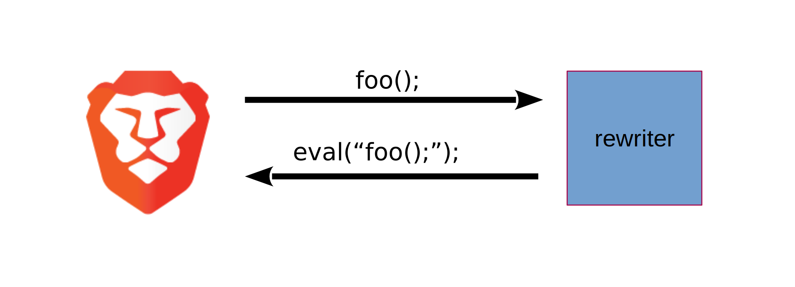

# Rewriter server for Brave

A server process for rewriting JavaScript code running inside Brave.

## Architecture

The server is listening to a UNIX domain socket on a specified path and will
rewrite all strings that are sent to this domain socket (i.e., it will read the
string, rewrite it and send it back). The modified brave/v8 version (see the
'Running brave' section) will connect to this socket whenever it compiles
JavaScript. Every code that is supposed to be compiled will be sent to the
rewriter server via this socket and then replaced by the reply from the server.



If brave can't connect to the server, it will just compile the JavaScript as it
would do in vanilla Brave. This means that the server can be shut down, changed
and started again without breaking the current running Brave instance.

## Building

Clone the git repository and run:
`mkdir build && cmake .. && cmake --build`

## Running

First you need to set the `JSFLOW_REWRITER` environment variable to a writable
path and exportt it:

`$ export JSFLOW_REWRITER=/tmp/rewriter`.

We use this file for our socket connection.

Now start the `jsflow-rewriter` binary in the `main` folder:

`./main/jsflow-rewriter`

## Running brave

Create a Brave development environment as described
[here](https://github.com/brave/brave-browser/wiki#build-instructions).

Go to the `src/v8/` directory and add my
[v8 repository](https://github.com/Teemperor/v8/tree/shim) as a remote:

`$ git remote add mod https://github.com/Teemperor/v8`

Now checkout the `shim` branch in my repository:

```
$ git fetch --all
$ git checkout -b shim mod/shim
```

**Note:** You probably have to rebase this branch on the v8 master:

`$ git rebase master`

Now build brave as described in the brave wiki. Afterwards run brave with the
correct `JSFLOW_REWRITER` environment variable set and
**sandboxing disabled**:

`$ JSFLOW_REWRITER=/tmp/rewriter ./src/out/Release/brave --no-sandbox`